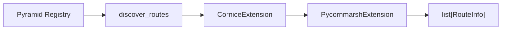

# Extensions

Extensions enrich the base route and view metadata with library-specific information. They form a pipeline: each extension receives the routes produced so far and returns an enriched version.

## How extensions work



1. `discover_routes` reads Pyramid's introspectable registry and produces a base `list[RouteInfo]` with path parameters, HTTP methods, permissions, and docstrings.
2. Each extension's `is_available()` is checked -- if the extension's dependency is not installed, it is skipped.
3. Each available extension's `enrich()` receives the registry and the current route list, and returns an updated list.

Extensions are run in order. The built-in Cornice extension runs before pycornmarsh, because pycornmarsh reads data that Cornice stores in `view.extra["cornice_args"]`.

## Built-in extensions

### Cornice

**Activated when:** `cornice` is installed.

The Cornice extension discovers Cornice services, matches them to routes by path pattern, and extracts Marshmallow schema metadata from service definitions.

It handles two schema patterns:

**Composite schemas** -- top-level `Nested` fields named `body`, `querystring`, or `path`:

```python
import marshmallow as ma

class BodySchema(ma.Schema):
    name = ma.fields.String(required=True)

class QuerySchema(ma.Schema):
    page = ma.fields.Integer()

class MyRequestSchema(ma.Schema):
    body = ma.fields.Nested(BodySchema)
    querystring = ma.fields.Nested(QuerySchema)
```

**Flat schemas** -- a single schema where the location is inferred from the Cornice validator function:

```python
@service.post(schema=BodySchema, validators=(colander_body_validator,))
def create_item(request):
    ...
```

The extension also extracts response schemas from `response_schema` attributes on view callables.

**What gets populated:**

| ViewInfo field          | Source                                      |
|-------------------------|---------------------------------------------|
| `parameters`            | Schema fields as `ParameterInfo` objects     |
| `request_schema`        | Body schema as `SchemaInfo`                  |
| `querystring_schema`    | Querystring schema as `SchemaInfo`           |
| `response_schema`       | `view_callable.response_schema`              |
| `description`           | Cornice service description (if view has none) |
| `extra["cornice_service_name"]` | Service name                        |
| `extra["cornice_args"]` | Raw Cornice definition args dict             |

### pycornmarsh

**Activated when:** `cornice` is installed (pycornmarsh builds on Cornice).

The pycornmarsh extension reads pycornmarsh-specific predicates from the Cornice service definition args (stored by the Cornice extension in `view.extra["cornice_args"]`).

**Recognized predicates:**

| Predicate          | ViewInfo field / extra key           | Description                  |
|--------------------|--------------------------------------|------------------------------|
| `pcm_request`      | `parameters`, `request_schema`, `querystring_schema` | Schema dict by location |
| `pcm_responses`    | `response_schema`, `response_schemas` | Schemas keyed by status code |
| `pcm_security`     | `security`, `extra["pcm_security"]`  | Auth scheme type             |
| `pcm_tags`         | `extra["pcm_tags"]`                  | API tags                     |
| `pcm_summary`      | `extra["pcm_summary"]`              | Endpoint summary             |
| `pcm_description`  | `description`, `extra["pcm_description"]` | Endpoint description    |
| `pcm_show`         | `extra["pcm_show"]`                 | Visibility flag              |

!!! note "Extension ordering"

    The pycornmarsh extension depends on the Cornice extension having already run. The built-in auto-discovery guarantees this ordering. If you supply extensions manually, make sure Cornice comes first.

## Writing a custom extension

Any class that satisfies the `IntrospectionExtension` protocol can be used as an extension:

```python
from pyramid_introspector.extensions import IntrospectionExtension
from pyramid_introspector.models import RouteInfo

class MyExtension:
    name = "my_library"

    def is_available(self) -> bool:
        try:
            import my_library
            return True
        except ImportError:
            return False

    def enrich(self, registry, routes: list[RouteInfo]) -> list[RouteInfo]:
        for route in routes:
            for view in route.views:
                view.extra["my_data"] = "enriched"
        return routes
```

The protocol requires:

- **`name`** (`str`) -- a human-readable identifier for logging
- **`is_available()`** -- return `True` if this extension's dependencies are installed
- **`enrich(registry, routes)`** -- receive the Pyramid registry and current route list, return the enriched list

### Passing extensions manually

```python
from pyramid_introspector import PyramidIntrospector

introspector = PyramidIntrospector(
    registry,
    extensions=[MyExtension()],
)
routes = introspector.introspect()
```

!!! warning

    When you pass extensions manually, auto-discovery is disabled entirely. If you still want the built-in extensions, include them explicitly:

    ```python
    from pyramid_introspector.extensions.cornice import CorniceExtension
    from pyramid_introspector.extensions.pycornmarsh import PycornmarshExtension

    introspector = PyramidIntrospector(
        registry,
        extensions=[CorniceExtension(), PycornmarshExtension(), MyExtension()],
    )
    ```

### Registering via entry points

For automatic discovery, register your extension class as an entry point in your package's `pyproject.toml`:

```toml
[project.entry-points."pyramid_introspector.extensions"]
my_library = "my_package.introspection:MyExtension"
```

The class will be imported, instantiated (with no arguments), and checked against the `IntrospectionExtension` protocol at runtime. If it satisfies the protocol, it is added to the extension pipeline after the built-in extensions.
