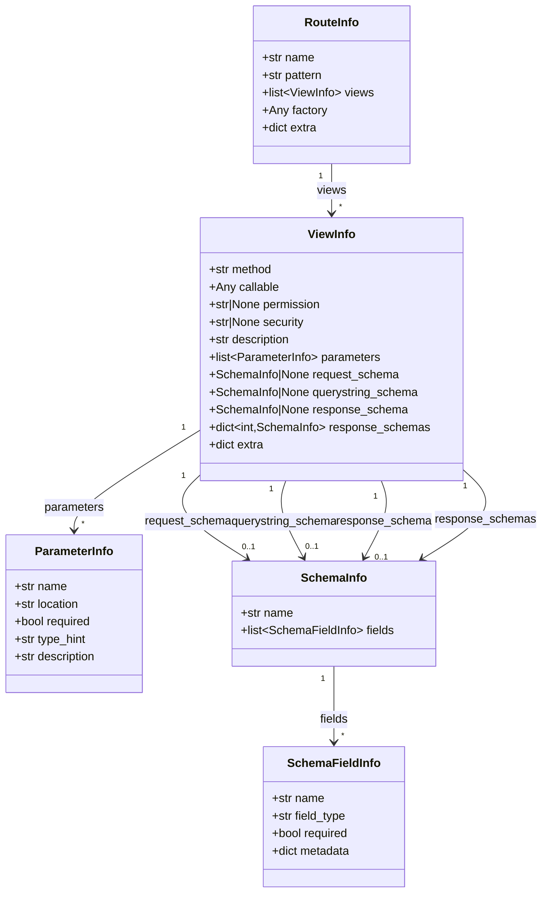

# Usage Guide

This guide walks through the data structures returned by `PyramidIntrospector` and shows common patterns for working with them.

## The data model



## RouteInfo

Each `RouteInfo` represents a single Pyramid route:

| Field     | Type             | Description                          |
|-----------|------------------|--------------------------------------|
| `name`    | `str`            | Pyramid route name                   |
| `pattern` | `str`            | URL pattern (e.g. `/items/{id}`)     |
| `views`   | `list[ViewInfo]` | One entry per HTTP method            |
| `factory` | `Any`            | Route factory for ACL contexts       |
| `extra`   | `dict`           | Extension-specific route metadata    |

## ViewInfo

Each `ViewInfo` represents one HTTP method handler on a route:

| Field                | Type                    | Description                                        |
|----------------------|-------------------------|----------------------------------------------------|
| `method`             | `str`                   | HTTP method (`GET`, `POST`, ...)                   |
| `callable`           | `Any`                   | The Python view function                           |
| `permission`         | `str \| None`           | Pyramid permission (from ACL)                      |
| `security`           | `str \| None`           | Auth scheme (e.g. `"bearer"`, `"BearerAuth"`)      |
| `description`        | `str`                   | First line of view docstring                       |
| `parameters`         | `list[ParameterInfo]`   | Path, querystring, and body parameters             |
| `request_schema`     | `SchemaInfo \| None`    | Marshmallow schema for request body                |
| `querystring_schema` | `SchemaInfo \| None`    | Marshmallow schema for querystring                 |
| `response_schema`    | `SchemaInfo \| None`    | Primary 2xx response schema                        |
| `response_schemas`   | `dict[int, SchemaInfo]` | All response schemas keyed by status code          |
| `extra`              | `dict`                  | Extension-specific view metadata                   |

`ViewInfo` also provides convenience properties for filtering parameters by location:

```python
view.path_parameters        # parameters where location == "path"
view.querystring_parameters # parameters where location == "querystring"
view.body_parameters        # parameters where location == "body"
view.has_body               # True if any body parameters exist
```

## Working with parameters

Parameters are extracted from route patterns (path parameters) and from Marshmallow schemas (querystring and body parameters, when Cornice/pycornmarsh is used):

```python
for route in routes:
    for view in route.views:
        for param in view.path_parameters:
            print(f"  path: {param.name} ({param.type_hint})")

        for param in view.querystring_parameters:
            print(f"  qs:   {param.name} ({param.type_hint}, required={param.required})")

        for param in view.body_parameters:
            print(f"  body: {param.name} ({param.type_hint})")
```

## Working with schemas

When Cornice or pycornmarsh extensions are active, views may carry Marshmallow schema information:

```python
for route in routes:
    for view in route.views:
        if view.request_schema:
            print(f"Request body schema: {view.request_schema.name}")
            for field in view.request_schema.fields:
                print(f"  {field.name}: {field.field_type} (required={field.required})")

        if view.querystring_schema:
            print(f"Querystring schema: {view.querystring_schema.name}")

        if view.response_schema:
            print(f"Response schema: {view.response_schema.name}")

        for status_code, schema in view.response_schemas.items():
            print(f"  {status_code}: {schema.name}")
```

## Permissions and security

Permissions are extracted from Pyramid's ACL system. Security metadata comes from pycornmarsh's `pcm_security` predicate:

```python
secured_views = [
    (route, view)
    for route in routes
    for view in route.views
    if view.permission
]

for route, view in secured_views:
    print(f"{view.method} {route.pattern} requires '{view.permission}'")
    if view.security:
        print(f"  auth scheme: {view.security}")
```

## The extra dict

Extensions can store arbitrary metadata in `route.extra` and `view.extra`. The Cornice extension stores:

- `view.extra["cornice_service_name"]` -- the Cornice service name
- `view.extra["cornice_args"]` -- the raw Cornice definition args

The pycornmarsh extension stores:

- `view.extra["pcm_tags"]` -- API tags
- `view.extra["pcm_summary"]` -- endpoint summary
- `view.extra["pcm_description"]` -- endpoint description
- `view.extra["pcm_security"]` -- security scheme
- `view.extra["pcm_show"]` -- visibility flag

```python
for route in routes:
    for view in route.views:
        tags = view.extra.get("pcm_tags", [])
        if tags:
            print(f"{view.method} {route.pattern} tags: {tags}")
```

## Filtering routes

Since routes are plain dataclasses in a list, standard Python filtering works:

```python
api_routes = [r for r in routes if r.pattern.startswith("/api/")]

post_views = [
    (route, view)
    for route in routes
    for view in route.views
    if view.method == "POST"
]

routes_with_schemas = [
    route for route in routes
    if any(v.request_schema for v in route.views)
]
```
